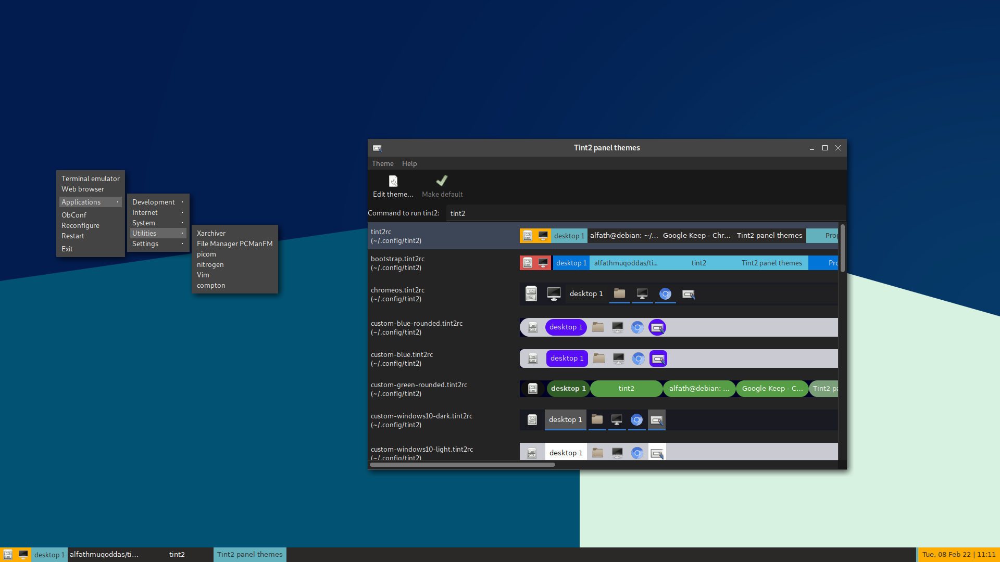

# Tint2 Theme
This is some of my tint2 themes

## Installation
- Copy to /home/.config/tint2 (for current user) or /usr/share/tint2 (for all users)
- Choose and apply the theme in tint2 settings

## Screenshot

